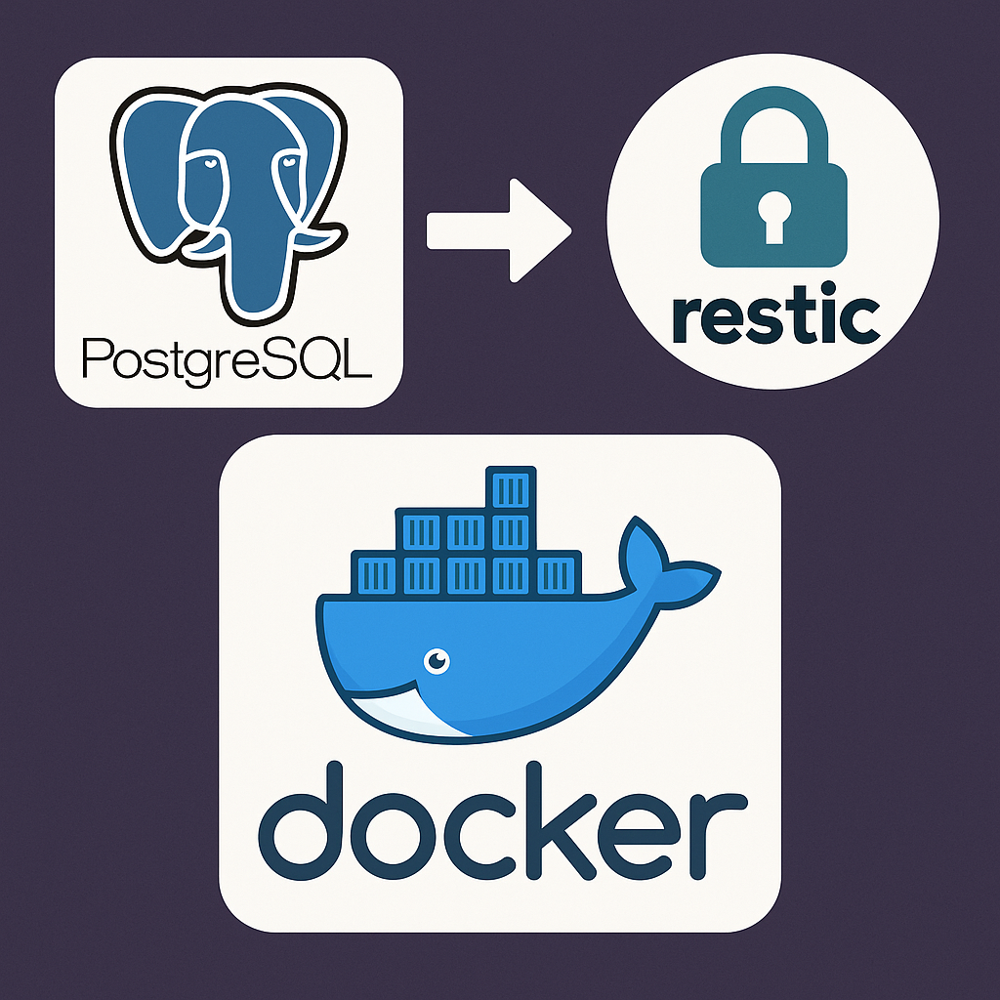

# PostgreSQL Backup with Restic

<div align="center">
  
</div>

This project provides an automated solution for backing up PostgreSQL databases using Restic, a modern and efficient backup program. The backup process is containerized using Docker, making it easy to deploy and maintain.

## Features

- Automated PostgreSQL database backups
- Efficient backup storage using Restic
- Backup verification
- Configurable retention policy
- Structured logging
- Docker-based deployment
- Automatic cleanup of old backups

## Prerequisites

- Docker
- Access to a PostgreSQL database
- A location for storing Restic repository (local directory, S3, etc.)

## Quick Start

1. Create a directory for the Restic repository:
```bash
mkdir repo
```

2. Run the container:
```bash
docker run -d \
  --name pg-backup \
  -e DB_HOST=your-db-host \
  -e DB_USER=your-db-user \
  -e DB_PASS=your-db-password \
  -e DB_NAME=your-db-name \
  -e RESTIC_REPOSITORY=/repo \
  -e RESTIC_PASSWORD=your-restic-password \
  -v ./repo:/repo \
  m4tt72/docker-pg-restic-backup
```

## Configuration

### Environment Variables

#### PostgreSQL Configuration
- `DB_HOST`: PostgreSQL host
- `DB_PORT`: PostgreSQL port (default: 5432)
- `DB_USER`: PostgreSQL username
- `DB_PASS`: PostgreSQL password
- `DB_NAME`: Database name to backup

#### Restic Configuration
- `RESTIC_REPOSITORY`: Path to Restic repository
- `RESTIC_PASSWORD`: Password for Restic repository
- `RESTIC_BACKUP_EXTRA_ARGS`: Additional arguments for the `restic backup` command (see [Restic Backup Documentation](https://restic.readthedocs.io/en/latest/040_backup.html))
- `RESTIC_FORGET_ARGS`: Arguments for the `restic forget` command (see [Restic Forget Documentation](https://restic.readthedocs.io/en/latest/060_forget.html))

#### Backup Configuration
- `VERIFY_BACKUP`: Enable/disable backup verification (default: true)
- `TZ`: Timezone for logging (default: Europe/Brussels)

### Restic Arguments Examples

#### Backup Arguments
The `RESTIC_BACKUP_EXTRA_ARGS` variable allows you to pass any additional arguments to the `restic backup` command. Some useful examples:

```bash
# Add tags to your backup
-e RESTIC_BACKUP_EXTRA_ARGS="--tag daily --tag postgres"

# Set compression level
-e RESTIC_BACKUP_EXTRA_ARGS="--compression max"

# Limit upload rate
-e RESTIC_BACKUP_EXTRA_ARGS="--limit-upload 1024"
```

See [Restic Backup Documentation](https://restic.readthedocs.io/en/latest/040_backup.html) for all available options.

#### Forget Arguments
The `RESTIC_FORGET_ARGS` variable allows you to configure the retention policy. Some examples:

```bash
# Keep the last 7 daily, 4 weekly, and 12 monthly backups
-e RESTIC_FORGET_ARGS="--keep-daily 7 --keep-weekly 4 --keep-monthly 12 --prune"

# Keep only the last 10 backups
-e RESTIC_FORGET_ARGS="--keep-last 10 --prune"

# Keep backups based on tags
-e RESTIC_FORGET_ARGS="--keep-tag important --keep-last 5 --prune"
```

See [Restic Forget Documentation](https://restic.readthedocs.io/en/latest/060_forget.html) for all available options.

## Backup Process

The backup process consists of the following steps:

1. **Initialization**: Checks and initializes the Restic repository if needed
2. **Database Dump**: Creates a compressed PostgreSQL dump
3. **Backup**: Stores the dump in the Restic repository
4. **Verification**: (Optional) Verifies the backup integrity
5. **Cleanup**: Removes temporary files and applies retention policy

## Backup Schedule

By default, the backup runs every 15 minutes. The schedule can be modified by mounting a custom cron file:

## Logging

The backup process provides detailed logging with timestamps and log levels:
- `[INFO]`: General information about the backup process
- `[ERROR]`: Error messages when something goes wrong
- `[SUCCESS]`: Successful completion of steps

Example log output:
```
[2024-03-14 10:00:00] [INFO] Starting backup process...
[2024-03-14 10:00:01] [INFO] Dumping database postgres...
[2024-03-14 10:00:05] [SUCCESS] Database dump completed: postgres_2024-03-14_10-00-01.sql.gz
[2024-03-14 10:00:10] [SUCCESS] Backup completed successfully
```

## Monitoring

You can monitor the backup process by checking the container logs:
```bash
docker logs -f pg-backup
```

## Troubleshooting

### Common Issues

1. **Database Connection Failed**
   - Check if the database host is accessible
   - Verify database credentials
   - Ensure the database service is running

2. **Restic Repository Issues**
   - Verify the repository path is correct
   - Check if the repository is properly initialized
   - Ensure the Restic password is correct

3. **Backup Verification Failed**
   - Check available disk space
   - Verify repository integrity with `restic check`

### Debugging

For more detailed logging, you can check the container logs:
```bash
docker logs -f pg-backup
```

## Security Considerations

1. **Password Security**:
   - Use environment files or secrets management for sensitive data
   - Never commit sensitive data to version control
   - Consider using Docker secrets in a Swarm environment

2. **Network Security**:
   - Limit network access to the backup service
   - Use secure connections for remote databases
   - When using cloud storage, ensure proper IAM/access policies

## License

MIT License